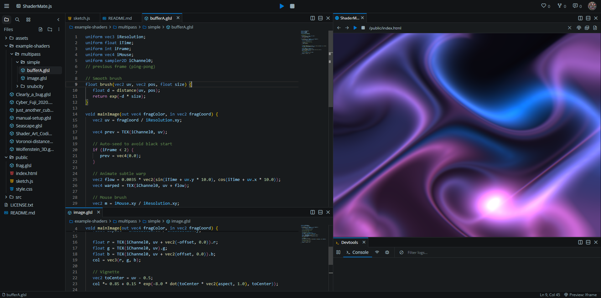

-----


[Open this repo in Codevre (free browser editor – no signup or setup)](https://codevre.com/editor?project=7kR8qQoxNCVu1AwDEoqetvzkVGC3_20250727214652256_cpj4)

# ShaderMate : A Robust WebGL(2) Multi-Pass Playground

ShaderMate is a lightweight and powerful JavaScript library designed to simplify WebGL shader development. Whether you're transitioning from platforms like ShaderToy, familiar with WebGL frameworks like TWGL.js, or just starting your journey into the world of shaders, ShaderMate provides a streamlined environment for creating stunning visual effects.

It handles much of the boilerplate WebGL setup, allowing you to focus on writing your GLSL code. With support for both WebGL1 and WebGL2, multi-pass rendering, and automatic uniform injection, you can quickly prototype and build complex shader experiences.

-----

## Getting Started

To begin using ShaderMate, you'll typically set up a project with four core files: `index.html`, `sketch.js`, `style.css`, and your primary fragment shader, `frag.glsl`.

### 1\. `index.html`

This is your main HTML file. It sets up the basic page structure, includes your JavaScript and CSS files, and provides the `<canvas>` element where your shaders will be rendered.

```html
<!DOCTYPE html>
<html lang="en">
<head>
    <meta charset="UTF-8">
    <meta name="viewport" content="width=device-width, initial-scale=1.0">
    <title>ShaderMate</title>
    <link rel="stylesheet" href="style.css">
</head>
<body>
    <canvas id="glcanvas"></canvas>
    <script src="/src/shaderMate.js"></script>
    <script src="sketch.js"></script>
</body>
</html>
```

**Key Points:**

  * **`<canvas id="glcanvas"></canvas>`**: This is the HTML element that ShaderMate will use to create the WebGL context and render your shaders. You can give it any ID, but `glcanvas` is the default that ShaderMate looks for. If you use a different ID, you'll need to specify it in the `startShaderMate` options.
  * **`path/to/shaderMate.js`**: Replace this with the actual path to the ShaderMate library JavaScript file. It should be loaded *before* your `sketch.js` file.
  * **`sketch.js`**: Your application logic and ShaderMate setup will reside here.
  * **`style.css`**: Used for basic styling, typically to make the canvas fill the screen.

### 2\. `style.css`

A minimal CSS file to ensure your canvas occupies the entire viewport:

```css
html,
body {
   margin: 0;
   height: 100%;
   overflow: hidden;
   background: #000
}

canvas {
   display: block;
   width: 100%;
   height: 100%
}
```

### 3\. `frag.glsl`

This is where you'll write your GLSL fragment shader code. For a basic single-pass setup, your shader will typically contain a `mainImage` function, similar to ShaderToy:

```glsl
// frag.glsl
void mainImage(out vec4 fragColor, in vec2 fragCoord) {
    vec2 uv = fragCoord.xy / iResolution.xy;
    fragColor = vec4(uv, 0.5 + 0.5 * sin(iTime), 1.0);
}
```

### 4\. `sketch.js`

This JavaScript file is where you initiate ShaderMate and define your shader passes.

```javascript
// sketch.js
document.addEventListener('DOMContentLoaded', () => {
    // Start ShaderMate with a single pass
    ShaderMate.startShaderMate('frag.glsl');
});
```

This minimal setup will load `frag.glsl` and render it to the screen. The `DOMContentLoaded` listener ensures the canvas is ready before `startShaderMate` is called.

-----

## Core Concepts

### Shader Passes

ShaderMate organizes your shader effects into **passes**. Each pass represents a single render operation using a specific fragment shader. Passes can render to the screen or to an offscreen texture (Framebuffer Object or FBO), allowing for complex multi-pass effects.

A pass is defined as an object with various properties:

```javascript
{
    name: 'A',          // (Optional) A unique name for the pass (e.g., 'A', 'B', 'BufferA')
    src: 'fragA.glsl',  // Path to the fragment shader file, or a direct GLSL string
    size: 'screen',     // Output size: 'screen', 'half', or [width, height]
    screen: false,      // If true, this pass renders directly to the canvas
    pingpong: false,    // If true, enables double buffering for feedback effects
    channels: [],       // Array of input textures/buffers for this pass (iChannel0, iChannel1, etc.)
    uniforms: {},       // Custom uniforms you want to send to this shader
    defines: [],        // Custom GLSL #define directives for this pass
    float: false,       // If true, the FBO texture will be high precision (float/half-float)
    wrap: 'clamp',      // Texture wrap mode for FBO: 'clamp' (CLAMP_TO_EDGE) or 'repeat' (REPEAT)
    filter: 'linear',   // Texture filter for FBO: 'linear' (LINEAR) or 'nearest' (NEAREST)
    depth: false        // If true, the FBO will have a depth attachment (WebGL2 only)
}
```

### Single Pass Rendering

For simpler effects, you might only need one shader that renders directly to the screen.

**Example: `sketch.js` for single pass**

```javascript
// sketch.js
document.addEventListener('DOMContentLoaded', () => {
    ShaderMate.startShaderMate('frag.glsl');
});
```

Here, `frag.glsl` will be the only shader. By default, if only one pass is provided as a string, ShaderMate assumes it's a screen-rendering pass.

Alternatively, you can specify it as an array of passes:

```javascript
// sketch.js
document.addEventListener('DOMContentLoaded', () => {
    ShaderMate.startShaderMate([
        {
            name: 'MainPass',
            src: 'frag.glsl',
            screen: true, // Explicitly render to screen
            size: 'screen'
        }
    ]);
});
```

### Multi-Pass Rendering

Multi-pass rendering is crucial for advanced effects like blurring, post-processing, simulations, and feedback loops. In ShaderMate, you define an array of passes, where each pass can render to an offscreen buffer (FBO) which can then be used as input for subsequent passes.

**Example: `sketch.js` for multi-pass (Buffer A to Screen)**

```javascript
// sketch.js
document.addEventListener('DOMContentLoaded', () => {
    ShaderMate.startShaderMate([
        {
            name: 'BufferA',
            src: 'bufferA.glsl',
            size: 'screen', // Render BufferA to an offscreen texture the size of the screen
            channels: [],   // No input textures for now
            screen: false   // Don't render this directly to screen
        },
        {
            name: 'Image',
            src: 'image.glsl',
            size: 'screen',
            screen: true,   // Render Image pass to the screen
            channels: [
                { id: 'BufferA' } // Use the output of BufferA as iChannel0
            ]
        }
    ]);
});
```

In this setup:

1.  `bufferA.glsl` will compute something and render it to an internal texture managed by ShaderMate.
2.  `image.glsl` will then take the output of `BufferA` as its `iChannel0` and render the final result to the canvas.

#### Ping-Pong Buffers

For feedback effects (like blurring over time, or dynamic simulations), you often need to read from the previous frame's output and write to the current frame's output. ShaderMate simplifies this with the `pingpong: true` option on a pass.

When `pingpong` is enabled, ShaderMate creates two internal buffers for that pass. In each frame, it swaps them: the `iChannel0` input will receive the *previous* frame's output, and the current frame's rendering will go into the *other* buffer.

**Example: `sketch.js` with a ping-pong buffer**

```javascript
// sketch.js
document.addEventListener('DOMContentLoaded', () => {
    ShaderMate.startShaderMate([
        {
            name: 'FeedbackBuffer',
            src: 'feedback.glsl',
            size: 'screen',
            pingpong: true, // Enable ping-pong buffering
            channels: [
                { id: 'FeedbackBuffer' } // iChannel0 will receive the *previous* frame's output from this pass
            ],
            screen: false
        },
        {
            name: 'RenderToScreen',
            src: 'render.glsl',
            size: 'screen',
            screen: true,
            channels: [
                { id: 'FeedbackBuffer' } // iChannel0 will receive the *current* output of FeedbackBuffer
            ]
        }
    ]);
});
```

---

🔄 Common Gotcha: Ping-Pong Starts Black and Stays Black

When using `pingpong: true`, **the very first frame's buffer is all zeros (black)**. If your shader reads the previous frame and does:

```glsl
fragColor = texture(iChannel0, uv) * 0.97;
```

…you're just multiplying black forever. If nothing ever adds color (e.g., on mouse input), your output stays black indefinitely.

#### ✅ Fixes:

* **Seed the buffer** on the first frame:

  ```glsl
  if (iFrame < 2) {
      fragColor = vec4(noise(uv) * 0.01, 0.0, 0.0, 1.0);
  }
  ```

* Or add a small bias:

  ```glsl
  fragColor += vec4(0.01);
  ```

* Or inject color conditionally, e.g. on mouse press:

  ```glsl
  if (iMouse.z > 0.0) {
      fragColor += vec4(0.5, 0.2, 1.0, 1.0);
  }
  ```
---

**Inside `feedback.glsl`:**

```glsl
// feedback.glsl
void mainImage(out vec4 fragColor, in vec2 fragCoord) {
    vec2 uv = fragCoord.xy / iResolution.xy;
    vec4 prevFrame = texture2D(iChannel0, uv); // Read from the previous frame

    // Simple feedback: blend previous frame with a new color based on time
    fragColor = mix(prevFrame, vec4(uv.x, uv.y, 0.0, 1.0), 0.01);
    fragColor.rgb += 0.01 * sin(iTime + uv.x * 10.0); // Add some animation
}
```

This shader reads from `iChannel0` (which is automatically connected to the "previous" frame's output of the same `FeedbackBuffer` pass) and mixes it with a new value, creating a trailing effect.

-----

## Automatic GLSL Injection (`autoSetup` and `inject` options)

ShaderMate automatically injects common GLSL code into your fragment shaders to provide a consistent and convenient development experience, especially for those familiar with ShaderToy. This includes version declarations, precision qualifiers, built-in uniform definitions, and a `mainImage` function wrapper.

### The Injected Header (when `inject.header` and `inject.builtins` are `true`)

When `autoSetup` is `true` (which is the default) or `inject` options are configured, ShaderMate prepends the following (or similar, depending on WebGL version) to your shader code:

```glsl
#version 300 es // Only for WebGL2
precision highp float;
precision highp int;

#if __VERSION__ >= 300
#define texture2D(s,u) texture(s,u)
#define textureCube(s,u) texture(s,u)
#define TEX(s,u) texture(s,u)
#define TEX_LOD(s,u,l) textureLod(s,u,l)
#else
#define TEX(s,u) texture2D(s,u)
#define TEX_LOD(s,u,l) texture2D(s,u)
#endif
out vec4 outColor; // Only for WebGL2
```

**Explanation of Injected Code:**

  * **`#version 300 es`**: Declares the GLSL ES 3.00 version, required for WebGL2. If using WebGL1, this line is omitted.
  * **`precision highp float; precision highp int;`**: Sets the default precision for floats and integers to `highp`. This is generally recommended for visual quality.
  * **`#define texture2D(...)` / `#define textureCube(...)` / `#define TEX(...)` / `#define TEX_LOD(...)`**: These macros provide compatibility for texture sampling between WebGL1 (GLSL ES 1.00) and WebGL2 (GLSL ES 3.00).
      * In GLSL ES 1.00, you use `texture2D` and `textureCube`.
      * In GLSL ES 3.00, the generic `texture` function is used for all texture types.
      * `TEX(s, u)` and `TEX_LOD(s, u, l)` provide a unified way to sample textures regardless of the WebGL version. It's recommended to use `TEX` for basic sampling and `TEX_LOD` for explicit level-of-detail sampling.
  * **`out vec4 outColor;`**: For WebGL2, fragment shaders output to an `out` variable (named `outColor` by default). In WebGL1, you write to `gl_FragColor`.

### The `mainImage` Wrapper (when `inject.mainWrap` is `true`)

If your shader defines a `mainImage` function (common in ShaderToy) instead of `void main()`, ShaderMate automatically wraps it. This allows you to write shaders in the familiar ShaderToy style while still integrating with the standard WebGL entry point (`void main`).

**Example of `mainImage` (your GLSL):**

```glsl
void mainImage(out vec4 fragColor, in vec2 fragCoord) {
    // Your shader logic
    fragColor = vec4(1.0);
}
```

**How it's wrapped (conceptually, by ShaderMate):**

```glsl
// ... injected header ...

void mainImage(out vec4 fragColor, in vec2 fragCoord) {
    // Your shader logic
    fragColor = vec4(1.0);
}

void main() {
    vec4 c;
    mainImage(c, gl_FragCoord.xy);
    // For WebGL2:
    outColor = c;
    // For WebGL1:
    // gl_FragColor = c;
}
```

This wrapper transforms `gl_FragCoord.xy` (the pixel coordinate) and assigns the output of `mainImage` to `outColor` (WebGL2) or `gl_FragColor` (WebGL1).

### Disabling Automatic Injection

You have fine-grained control over what ShaderMate injects:

  * **`autoSetup: false`**: Disables all automatic GLSL injection. You will need to provide the `#version`, `precision`, `out vec4 outColor;` (for WebGL2), and your own `void main()` function that directly sets `gl_FragColor` (WebGL1) or `outColor` (WebGL2). This gives you full control but requires more boilerplate.

    ```javascript
    ShaderMate.startShaderMate('myShader.glsl', { autoSetup: false });
    ```

    **If `autoSetup: false`, your `myShader.glsl` would need:**

    ```glsl
    #version 300 es // Or omit for WebGL1
    precision highp float;
    precision highp int;
    out vec4 outColor; // Or gl_FragColor for WebGL1

    void main() {
        // Your shader logic using gl_FragCoord.xy directly
        outColor = vec4(1.0);
    }
    ```

  * **`inject: { header: true, defines: false, mainWrap: false, builtins: true }`**: Allows you to enable or disable specific parts of the injection.

      * `header`: Controls `#version` and `precision` lines.
      * `defines`: Controls injection of custom `#define` directives you provide in `options.defines` or `pass.defines`.
      * `mainWrap`: Controls the `mainImage` to `main()` wrapper.
      * `builtins`: Controls the `texture2D` / `texture` macros and `out vec4 outColor;` declaration.

This flexibility allows you to customize the environment to your preferences, whether you want a ShaderToy-like experience or full manual control.

-----

## Available Uniforms

ShaderMate automatically provides several useful uniforms to your fragment shaders, similar to ShaderToy. These are automatically updated each frame.

### Core Uniforms

| Uniform Name         | Type    | Description                                                                                                                                                                                                            |
| :------------------- | :------ | :--------------------------------------------------------------------------------------------------------------------------------------------------------------------------------------------------------------------- |
| `uniform vec3 iResolution;` | `vec3`  | The resolution of the rendering target (e.g., `(canvas.width, canvas.height, 0.0)`). `z` component is always 0.                                                                                                    |
| `uniform float iTime;`       | `float` | Current time in seconds since the shader started.                                                                                                                                                                      |
| `uniform float iTimeDelta;`  | `float` | Time elapsed in seconds since the last frame (delta time).                                                                                                                                                            |
| `uniform float iFrameRate;`  | `float` | Current frames per second (FPS).                                                                                                                                                                                       |
| `uniform int iFrame;`        | `int`   | Current frame number.                                                                                                                                                                                                  |
| `uniform vec4 iMouse;`       | `vec4`  | Mouse coordinates and click state. `(x, y)` are the current mouse position (in pixels, origin bottom-left). `z` and `w` store the `(x, y)` coordinates of the last mouse click when the mouse button was pressed. |
| `uniform vec4 iDate;`        | `vec4`  | Current date and time: `(year, month, day, seconds_since_midnight)`.                                                                                                                                                   |

### Channel Uniforms

These uniforms are available when you load textures or buffers into your shader's channels.

| Uniform Name               | Type      | Description                                                                                                                                                                                                                                                                                       |
| :------------------------- | :-------- | :------------------------------------------------------------------------------------------------------------------------------------------------------------------------------------------------------------------------------------------------------------------------------------------------ |
| `uniform sampler2D iChannel0;` | `sampler2D` | Texture sampler for input channel 0. Connected to the `channels[0]` definition in your pass.                                                                                                                                                                                                                                |
| `uniform sampler2D iChannel1;` | `sampler2D` | Texture sampler for input channel 1. Connected to the `channels[1]` definition.                                                                                                                                                                                                                                              |
| `uniform sampler2D iChannel2;` | `sampler2D` | Texture sampler for input channel 2. Connected to the `channels[2]` definition.                                                                                                                                                                                                                                              |
| `uniform sampler2D iChannel3;` | `sampler2D` | Texture sampler for input channel 3. Connected to the `channels[3]` definition.                                                                                                                                                                                                                                              |
| `uniform vec3 iChannelResolution[4];` | `vec3[4]` | An array of `vec3` where `iChannelResolution[N].xy` provides the width and height of `iChannelN`. `z` is always 0. This is useful for normalizing texture coordinates (`uv = fragCoord.xy / iChannelResolution[N].xy;`).                                                                                |
| `uniform float iChannelTime[4];`      | `float[4]`  | An array of `float` where `iChannelTime[N]` provides the time in seconds since a video or audio channel (`iChannelN`) started playing.                                                                                                                                                                                 |

-----

💡 **Tip:** ShaderMate only sets uniforms like `iTime`, `iResolution`, `iChannel0`, etc. **if you declare them**. Forgetting to declare them silently breaks your shader. Use:

```glsl
uniform sampler2D iChannel0;
uniform float iTime;
uniform vec3 iResolution;
```
-----

## Loading Textures and Buffers

ShaderMate provides convenient ways to load various types of external assets as textures or use the output of other passes as textures.

You specify input channels within the `channels` array of a pass configuration. The order in the array corresponds to `iChannel0`, `iChannel1`, `iChannel2`, and `iChannel3`.

### 1\. Loading Image Textures (`url`)

Load a standard 2D image from a URL.

```javascript
// In your sketch.js pass definition:
channels: [
    { url: 'assets/texture.png', filter: 'linear', wrap: 'repeat', flipY: true }
]
```

**Options:**

  * **`url` (string, required)**: The URL to the image file.
  * **`filter` ('linear' or 'nearest', default 'linear')**: How the texture is sampled when magnified or minified.
  * **`wrap` ('clamp' or 'repeat', default 'clamp')**: How texture coordinates outside the 0-1 range behave.
  * **`flipY` (boolean, default `false`)**: Whether to flip the image vertically on load. Useful for images where `(0,0)` is top-left, but WebGL's origin is bottom-left.

### 2\. Loading Cube Maps (`cubemap`)

Load a cube map texture for skyboxes or environment mapping. You provide an array of 6 URLs for the faces.

```javascript
// In your sketch.js pass definition:
channels: [
    {
        cubemap: [
            'assets/posx.jpg', 'assets/negx.jpg',
            'assets/posy.jpg', 'assets/negy.jpg',
            'assets/posz.jpg', 'assets/negz.jpg'
        ],
        filter: 'linear'
    }
]
```

**Options:**

  * **`cubemap` (array of 6 strings, required)**: URLs for the cube map faces in the order: positive X, negative X, positive Y, negative Y, positive Z, negative Z.
  * **`filter` ('linear' or 'nearest', default 'linear')**: Filtering for the cube map.
  * **`wrap` ('clamp' or 'repeat', default 'clamp')**: Wrap mode (usually `clamp` for cube maps).

### 3\. Loading Video Textures (`video`)

Stream a video file and use each frame as a texture input.

```javascript
// In your sketch.js pass definition:
channels: [
    { video: 'assets/myvideo.mp4', filter: 'linear', flipY: true }
]
```

**Options:**

  * **`video` (string, required)**: The URL to the video file.
  * **`filter` ('linear' or 'nearest', default 'linear')**: Filtering for the video texture.
  * **`wrap` ('clamp' or 'repeat', default 'clamp')**: Wrap mode.
  * **`flipY` (boolean, default `true`)**: Videos typically need to be flipped.

### 4\. Loading Audio FFT Data (`audio` or `audioFFT`)

Process an audio file and get its frequency spectrum (FFT) as a 1D texture. The texture's width will be `fftSize` and height 1.

```javascript
// In your sketch.js pass definition:
channels: [
    { audioFFT: 'assets/myaudio.mp3', fftSize: 1024 }
]
```

**Options:**

  * **`audio` or `audioFFT` (string, required)**: The URL to the audio file.
  * **`fftSize` (number, default 512)**: The FFT size, which determines the resolution of the frequency data (must be a power of 2, e.g., 32, 64, 128, ..., 2048).

### 5\. Using Other Passes as Channels (`id`)

To connect the output of one pass as an input to another, use the `id` property, referencing the `name` of the source pass.

```javascript
// In your sketch.js pass definition:
channels: [
    { id: 'BufferA' }, // Use the output of the pass named 'BufferA' as iChannel0
    { id: 'FeedbackBuffer' } // Use the output of 'FeedbackBuffer' as iChannel1
]
```

**Important Notes for Channels:**

  * **`iChannelResolution[N]`**: When you use any channel, the `iChannelResolution[N]` uniform will be populated with its dimensions, allowing you to correctly normalize UVs.
  * **`iChannelTime[N]`**: For video and audio channels, `iChannelTime[N]` will be available.
  * **Order Matters**: The order of objects in the `channels` array directly maps to `iChannel0`, `iChannel1`, `iChannel2`, `iChannel3`.
  * **Referencing Ping-Pong Buffers**: When a pass has `pingpong: true`, and you reference it by its `id` in another pass's `channels` array, you will always get the *most recently rendered* frame from that ping-pong pair. If the ping-pong pass references *itself* as a channel, it will get the *previous* frame's output.

-----

## Custom Uniforms

You can define your own custom uniforms in your shader and update them from JavaScript.

1.  **Declare in GLSL:**

    ```glsl
    // frag.glsl
    uniform float u_myValue;
    uniform vec3 u_myColor;
    uniform mat4 u_transformMatrix;

    void mainImage(out vec4 fragColor, in vec2 fragCoord) {
        fragColor = vec4(u_myColor * u_myValue, 1.0);
    }
    ```

2.  **Define in JavaScript (in your pass config):**

    ```javascript
    // sketch.js
    ShaderMate.startShaderMate([
        {
            name: 'MyShader',
            src: 'frag.glsl',
            screen: true,
            uniforms: {
                u_myValue: { type: '1f', value: 0.5 },
                u_myColor: { type: '3f', value: [1.0, 0.0, 0.0] },
                u_transformMatrix: { type: 'Matrix4fv', value: someFloat32ArrayOfMatrixData, transpose: false }
            }
        }
    ]);
    ```

**Uniform `type` options:**

| Type          | GLSL Equivalent | Value Format (JavaScript)                                         | Description                                                    |
| :------------ | :-------------- | :---------------------------------------------------------------- | :------------------------------------------------------------- |
| `'1f'`        | `float`         | `number`                                                          | Single float.                                                  |
| `'2f'`        | `vec2`          | `[number, number]`                                                | Two floats.                                                    |
| `'3f'`        | `vec3`          | `[number, number, number]`                                        | Three floats.                                                  |
| `'4f'`        | `vec4`          | `[number, number, number, number]`                                | Four floats.                                                   |
| `'1i'`        | `int`           | `number`                                                          | Single integer.                                                |
| `'2i'`        | `ivec2`         | `[number, number]`                                                | Two integers.                                                  |
| `'3i'`        | `ivec3`         | `[number, number, number]`                                        | Three integers.                                                |
| `'4i'`        | `ivec4`         | `[number, number, number, number]`                                | Four integers.                                                 |
| `'1fv'`       | `float[]`       | `Float32Array` or `number[]`                                      | Array of floats (for `uniform float myArray[N]`).            |
| `'2fv'`       | `vec2[]`        | `Float32Array` or `number[]` (e.g., `[x1,y1,x2,y2]`)              | Array of vec2s.                                                |
| `'3fv'`       | `vec3[]`        | `Float32Array` or `number[]` (e.g., `[x1,y1,z1,x2,y2,z2]`)        | Array of vec3s.                                                |
| `'4fv'`       | `vec4[]`        | `Float32Array` or `number[]` (e.g., `[x1,y1,z1,w1,x2,y2,z2,w2]`) | Array of vec4s.                                                |
| `'Matrix3fv'` | `mat3`          | `Float32Array` or `number[]` (9 elements)                         | 3x3 matrix. Requires `transpose: true/false`.                  |
| `'Matrix4fv'` | `mat4`          | `Float32Array` or `number[]` (16 elements)                        | 4x4 matrix. Requires `transpose: true/false`.                  |

**Updating Custom Uniforms:**

To update custom uniforms dynamically, you'll need to use the `on` event listener for `beforeFrame`.

```javascript
// sketch.js
let customColor = [1.0, 0.0, 0.0];

ShaderMate.startShaderMate([
    {
        name: 'MyShader',
        src: 'frag.glsl',
        screen: true,
        uniforms: {
            u_dynamicColor: { type: '3f', value: customColor } // Initial value
        }
    }
]);

ShaderMate.on('beforeFrame', ({ time }) => {
    // Update the color based on time
    customColor[0] = 0.5 + 0.5 * Math.sin(time);
    customColor[1] = 0.5 + 0.5 * Math.cos(time);
    customColor[2] = 0.5 + 0.5 * Math.sin(time + Math.PI);
    // ShaderMate automatically picks up changes to array values used in uniforms
});
```

-----

## ShaderMate API Reference

The `ShaderMate` object exposes a simple API for starting the shader graph and handling events.

### `ShaderMate.startShaderMate(passesOrPath, options)`

This is the main function to initialize and run your shader graph.

  * **`passesOrPath`**:

      * **`string`**: A path to a single fragment shader file (e.g., `'frag.glsl'`). This will be treated as a single screen-rendering pass.
      * **`Array<Object>`**: An array of pass configuration objects (see "Shader Passes" section for details). This is used for multi-pass setups.

  * **`options` (Object, optional)**: Configuration options for the entire ShaderMate instance.

      * **`canvas` (HTMLElement, optional)**: The `<canvas>` element to use for rendering. Defaults to `document.getElementById('glcanvas')`.
      * **`autoSetup` (boolean, default `true`)**: If `false`, disables all automatic GLSL injection. You must manually add `#version`, `precision`, `out vec4 outColor;` (WebGL2), and `void main()` in your shaders.
      * **`inject` (Object, optional)**: Fine-grained control over GLSL injection. Only relevant if `autoSetup` is `true` (or if you want to partially override the default `autoSetup` behavior).
          * `header` (boolean, default `true`): Inject `#version` and `precision` lines.
          * `defines` (boolean, default `true`): Inject custom `#define` directives.
          * `mainWrap` (boolean, default `true`): Wrap `mainImage` in `void main()`.
          * `builtins` (boolean, default `true`): Inject `texture2D` / `texture` macros and `out vec4 outColor;` (WebGL2).
      * **`defines` (Array\<string | Object\>, optional)**: Global GLSL `#define` directives applied to all passes. Can be an array of strings (e.g., `['MY_DEFINE']`) or an array of objects (`[{ MY_VALUE: 10 }]`).
      * **`includes` (Object, optional)**: A map of include paths to their content. Use this to pre-load GLSL include files without network requests. Example: `{ 'my_utils.glsl': 'vec3 colorize(vec3 c) { return c * 2.0; }' }`.
      * **`showExpandedOnError` (boolean, default `true`)**: If `true`, compilation errors will show the full, preprocessed shader source with line numbers, highlighting the error line. Set to `false` for a more concise error log.
      * **`startPaused` (boolean, default `false`)**: If `true`, the animation will not start automatically. You'll need to call `ShaderMate.play()` to begin animation.
      * **`fixedDelta` (number, default `0`)**: If greater than 0, `iTimeDelta` will be fixed to this value (in seconds) instead of reflecting actual frame time. Useful for deterministic simulations.
      * **`timeScale` (number, default `1.0`)**: Multiplier for `iTime`. A value of `0.5` makes time run half as fast; `2.0` makes it twice as fast.

### `ShaderMate.on(eventName, callback)`

Registers an event listener.

  * **`eventName` (string)**: The name of the event to listen for.
      * `'beforeFrame'`: Fired before each frame is rendered. The callback receives an object `{ time: float, frame: int, dt: float, fps: float }`.
  * **`callback` (function)**: The function to call when the event fires.

### `ShaderMate.off(eventName, callback)`

Removes an event listener previously registered with `ShaderMate.on()`.

### `ShaderMate.play()`

Starts the animation loop if it's currently paused.

### `ShaderMate.pause()`

Pauses the animation loop.

### `ShaderMate.getTime()`

Returns the current accumulated time in seconds (`iTime`).

### `ShaderMate.getFrame()`

Returns the current frame number (`iFrame`).

-----

## Error Handling

ShaderMate provides detailed error reporting for GLSL compilation and linking errors. When an error occurs, it attempts to translate the logical line number reported by WebGL (which refers to the preprocessed code) back to the physical line number in your original source file, and will log the expanded source for easier debugging.

-----

## Best Practices

  * **Organize Your Code**: For multi-pass setups, keep each pass's GLSL in its own file (e.g., `bufferA.glsl`, `image.glsl`).
  * **Use Includes**: Break down complex GLSL functions or common utilities into separate `.glsl` files and use `#include "my_utils.glsl"` directives to manage your shader code. ShaderMate will load these files for you.
  * **Performance**:
      * Be mindful of `float` (high precision) textures on older devices, as they can be slower or unsupported.
      * Minimize `texture2D` calls inside loops.
      * Consider `size: 'half'` for passes that don't require full screen resolution (e.g., blurs).
  * **Cross-Origin Issues**: If loading images, videos, or audio from different domains, ensure they are served with appropriate CORS headers (`Access-Control-Allow-Origin`). Otherwise, your textures might not load or might cause security errors.
  * **Memory Management**: ShaderMate handles WebGL resource cleanup (textures, FBOs, programs) automatically via its `RefPool` when objects are no longer referenced. However, be aware that holding onto large textures or creating many passes can consume significant GPU memory.

-----
## License

This project is licensed under the [GNU GPL v3](https://www.gnu.org/licenses/gpl-3.0.html).

## TODO / Roadmap

### Debug & Dev UX
- [ ] Stats overlay (FPS, frame count, ms) toggled with a key (e.g. `F1`).

### Live Controls
- [ ] Optional uniform inspector overlay (dat.gui / lil-gui via CDN) to tweak uniforms in real time.

### Canvas & Input Handling
- [ ] More sizing modes (custom width/height, aspect locks) and clearer docs for each.
- [ ] Corrected mouse mapping for centered/letterboxed canvases with odd aspect ratios (helper to convert DOM coords → shader coords).
